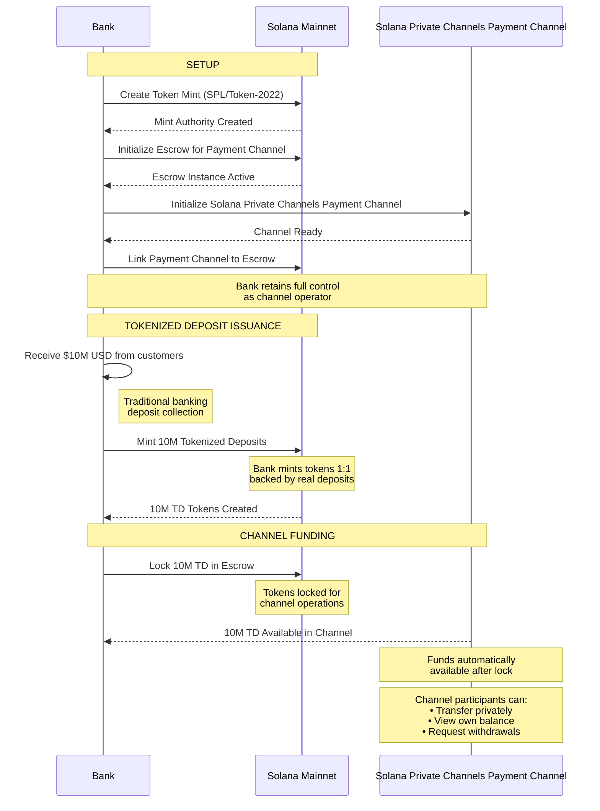
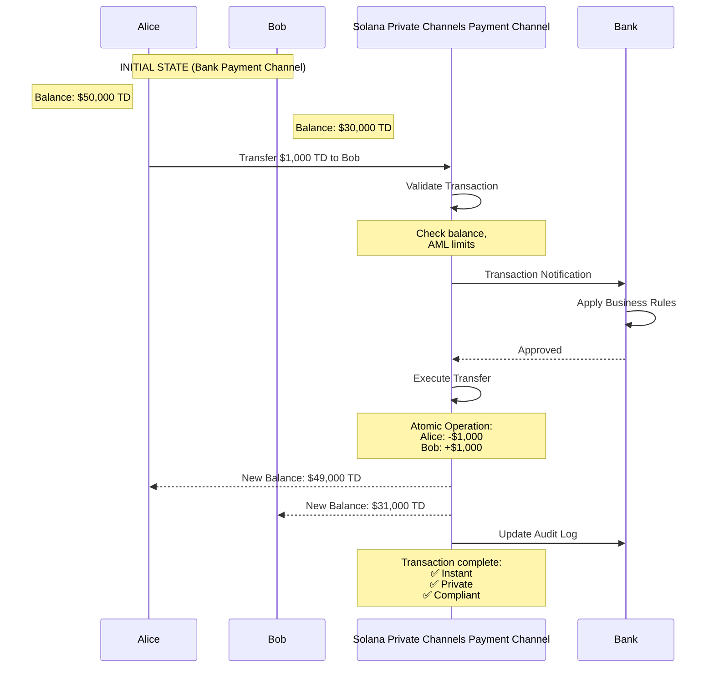
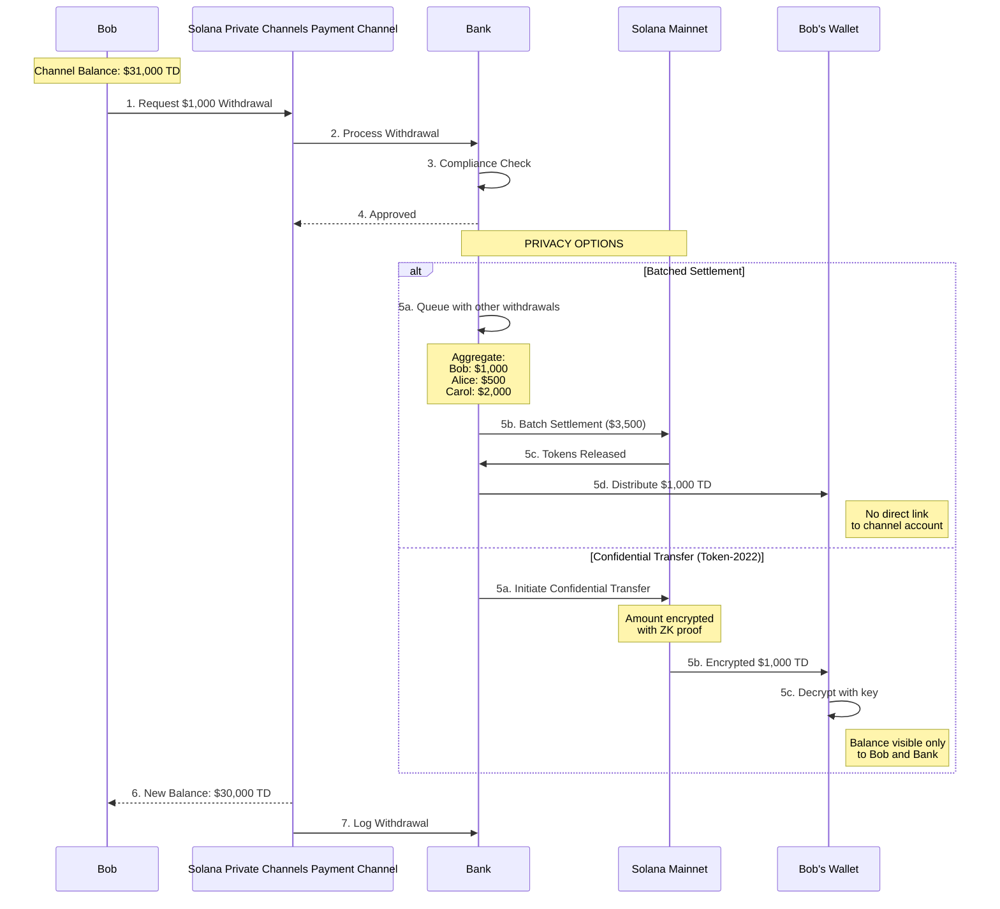

<div align="center">
  <br />
  
  <br />
  <br />

  <h3>Solana Private Channels: Enterprise Infrastructure for Internet Capital Markets</h3>

  <br />

[](LICENSE)
</div>

Solana Private Channels is a payment channel with direct access to Solana Mainnet liquidity. Solana Private Channels provides a complete infrastructure solution to execute thousands of transactions instantly with privacy, control and permissioning, while assets are readily accessible to and from Solana Mainnet.

> ## ⚠️ SECURITY NOTICE
>
> **This code has not been audited and is under active development. Use at your own risk.**
>
> Not recommended for production use with real funds without a thorough security review. The authors and contributors are not responsible for any loss of funds or damages resulting from the use of this library.

---

## Documentation

- **[All Documentation](docs/README.md)** — Architecture, program references, guides, and operational requirements

## How Solana Private Channels Works

Solana Private Channels operates as a payment channel with direct access to Solana Mainnet liquidity:

- **Solana Private Channels Channel**: Your private transaction batching system with direct Solana Mainnet access. Execute transactions with instant finality and full control over who participates and what rules apply.
- **Solana Private Channels Escrow Program**: Makes assets readily accessible to the payment channel. Users deposit SPL tokens. The program locks funds in escrow for use within the channel.
- **Solana Private Channels Withdrawal Program**: Withdrawals are initiated by sending tokens to the withdraw program inside the payment channel. The withdraw program burns the tokens and SPL tokens are released from the escrow program.
- **Solana Private Channels Indexer/Operator**: Monitors deposits and withdrawals, orchestrates state synchronization, and maintains an auditable record of all activity.
- **Solana Private Channels Auth**: Optional authentication service. Issues signed JWTs for registered users and verified Solana wallets. When enabled, the gateway enforces RBAC — restricting account queries to wallets the caller owns and reserving operator-only methods (block/transaction fetching, transaction simulation) for elevated accounts.

### Case Study - Payments

#### 1. Tokenized Deposit Issuance Flow

This flow shows how a bank creates a token mint and issues tokenized deposits on Solana mainnet, initializes a Solana Private Channels payment channel for transactions between bank customers [Alice and Bob].



#### 2. Payment Transfer Flow (Within Channel)

This flow demonstrates a simple $1,000 transfer between bank customers Alice and Bob within the payment channel, showing how privacy is maintained while the bank retains control.



#### 3. Withdrawal Flow - Privacy Preserving Options

This flow shows how Bob withdraws $1,000 from the payment channel, subject to the bank's compliance policies and approval.

The flow shows two withdrawal methods that allow Bob to withdraw while preserving privacy.



### Transaction Processing Pipeline

Within the payment channel, transactions are processed through a **five-stage pipeline** for near-instant finality:

1. **Dedup**: Filters duplicate transactions using a blockhash-keyed signature cache
2. **SigVerify**: Parallelizes Ed25519 signature verification across configurable workers
3. **Sequencer**: Builds a DAG of account dependencies to produce conflict-free batches
4. **Executor**: Runs batches with custom execution callbacks:
   - **AdminVM**: Bypasses bytecode execution for privileged mint operations
   - **GaslessCallback**: Synthesizes fee payer accounts on-demand (zero operational overhead)
5. **Settler**: Batches results every 100ms and commits to PostgreSQL/Redis with atomic writes

### Solana Private Channels Escrow/Withdrawal Programs

- **Solana Private Channels Escrow Program**: Mainnet token custody with SMT security (Program ID: `GokvZqD2yP696rzNBNbQvcZ4VsLW7jNvFXU1kW9m7k83`)
- **Solana Private Channels Withdrawal Program**: Channel withdrawal processing (token burning) (Program ID: `J231K9UEpS4y4KAPwGc4gsMNCjKFRMYcQBcjVW7vBhVi`)

### Indexer

The indexer monitors Solana Mainnet and your payment channel for deposits and withdrawals. It supports **two datasource strategies**:

1. **RPC Polling**: Fetches blocks sequentially via `getBlock` RPC calls
2. **Yellowstone gRPC**: Real-time block streaming via gRPC (Yellowstone protocol)

Both strategies parse Escrow/Withdraw Program instructions and write to PostgreSQL. The indexer automatically **backfills missing slots** on restart using parallel RPC batch fetching. An Operator service monitors new transactions in the database to trigger new mints in the channel or withdrawals back to Mainnet, ensuring synchronization.

## Quick Start

Get Solana Private Channels running locally in under 5 minutes:

```bash
# Clone repository
git clone https://github.com/solana-foundation/solana-private-channels.git
cd private_channel

# Install dependencies
make install

# Build all components
make build

# Test all components
make all-test
```

## Local Development

### Prerequisites

- [**Rust**](https://rust-lang.org/tools/install/): 1.91 (pinned via `rust-toolchain.toml`; install [rustup](https://rustup.rs) and it will fetch the right channel automatically)
- [**Solana CLI**](https://solana.com/docs/intro/installation): version pinned in [`versions.env`](versions.env). Run `make install-toolchain` to install/verify. Do not install a specific version by hand — `versions.env` is the source of truth for every Dockerfile, the Yellowstone Geyser plugin build, and CI.
- [**Docker**](https://docs.docker.com/get-docker/): 26.0+ with Docker Compose
- [**pnpm**](https://pnpm.io/installation): 10.0+ (for TypeScript clients)

### Repository Structure

| Component | Path | Description |
|-----------|------|-------------|
| **Solana Private Channels Core** | [core/](core/) | Payment channel transaction pipeline |
| **Solana Private Channels DB** | [core/src/accounts/](core/src/accounts/) | Accounts database with multi-backend support |
| **Gateway** | [gateway/](gateway/) | Read/write node routing service with optional RBAC enforcement |
| **Auth** | [auth/](auth/) | Authentication service — user registration, login, wallet verification, JWT issuance |
| **Escrow Program** | [private-channel-escrow-program/](private-channel-escrow-program/) | Mainnet token deposit via escrow |
| **Withdrawal Program** | [private-channel-withdraw-program/](private-channel-withdraw-program/) | Channel token withdrawal via burning |
| **Indexer + Operator** | [indexer/](indexer/) | Mainnet & channel transaction monitoring & automation |
| **Integration Tests** | [integration/](integration/) | Cross-workspace integration tests |
| **Deployment** | [docker-compose.yml](docker-compose.yml) | Full stack deployment configuration |

### Install Dependencies

```bash
make install
```

### Build All Programs

```bash
make build
```

### Docker build cache

Docker builds use BuildKit cache mounts for cargo and apt, so rebuilds after the first cold build are fast. One-time setup on a fresh host: `sudo make install-buildkit-cache` merges a BuildKit GC fragment into `/etc/docker/daemon.json` so the cache stays capped (~50 GB) instead of growing unbounded. The `make docker-build`, `make docker-up`, and `make docker-rebuild` targets (and devnet variants) check for this and fail with an actionable message if it's missing.

Useful commands:

```bash
# Force a fresh build (ignore all caches)
docker compose build --no-cache <service>

# Reclaim disk by clearing the build cache
docker builder prune -af
```

### Building a single Dockerfile standalone

Compose loads [`versions.env`](versions.env) automatically; standalone `docker build` doesn't. Source the file first so the build args are available, then pass only the args that the Dockerfile declares:

```bash
set -a; . versions.env; set +a

docker build --build-arg SOLANA_VERSION --build-arg PNPM_VERSION -f Dockerfile .
docker build --build-arg SOLANA_VERSION --build-arg YELLOWSTONE_TAG -f validator.Dockerfile .
docker build --build-arg GRAFANA_VERSION    -f Dockerfile.grafana    .
docker build --build-arg PROMETHEUS_VERSION -f Dockerfile.prometheus .
docker build --build-arg NODE_VERSION --build-arg PNPM_VERSION -f admin-ui/Dockerfile .
```

`versions.env` is the single source of truth for every pinned version.

### Run Tests

```bash
# Run all tests (unit + integration)
make all-test

# Run unit tests only
make unit-test

# Run integration tests only
make integration-test
```

### Docker stack

The Makefile wraps the full compose stack so you don't have to remember the `--env-file` chain. Precondition: copy the env template once (`cp .env.example .env.local`) and fill in the required secrets. No defaults are shipped: `POSTGRES_PASSWORD` and `POSTGRES_REPLICATION_PASSWORD` MUST be set (and `JWT_SECRET` if you enable auth) or the stack fails to start. Generate strong values with `openssl rand -hex 32`. Put secrets in the gitignored `.env` (loaded last, overrides the templates) rather than the tracked `.env.local`.

**Run `make build-localnet` once before the first `make docker-up`.** It generates an operator keypair and patches the real `PRIVATE_CHANNEL_ADMIN_KEYS` / `ADMIN_PRIVATE_KEY` and program IDs into `.env.local`, replacing the template placeholders. Skipping it leaves `PRIVATE_CHANNEL_ADMIN_KEYS=your_admin_public_key`, which the write-node rejects at startup (`Invalid admin key … Invalid Base58 string`).

```bash
# First run only: bootstrap .env.local (admin key + program IDs)
make build-localnet

# Build all images
make docker-build

# Start the full stack in the background
make docker-up

# Rebuild changed services and restart
make docker-rebuild

# Tail logs / inspect / stop
make docker-logs
make docker-ps
make docker-down

# Reset: wipe data volumes, then start clean
make docker-clean && make docker-up
```

**Resetting after a credential change.** Postgres applies `POSTGRES_PASSWORD` / `POSTGRES_REPLICATION_PASSWORD` only when it *first* initializes its data volume. If you change those values — or reuse volumes another run initialized with different credentials (e.g. `bench-tps/scripts/run.sh`, which generates its own passwords) — the server keeps the old password while the clients send the new one. Symptoms: `password authentication failed for user "private_channel"` on the nodes, and `postgres-replica` stuck at *Waiting for primary to be ready*. Fix: `make docker-clean` (drops the volumes) then `make docker-up`, so Postgres re-initializes with the current credentials.

Devnet variants exist for every target (`make docker-devnet-up`, `make docker-devnet-down`, etc.) and read `.env.devnet` instead. Run `make help` for the full list.

### Running with Auth (RBAC)

Auth is opt-in. The gateway runs without it by default, and even when enabled the gateway's RBAC
(account-gating and operator-only methods) protects **only the gateway port**. The read/write node RPC
ports have **no node-side authentication** of their own, so the reference compose binds them to loopback
(`127.0.0.1`): reachable from the host for local development, but not from other machines.

To enable auth, set `JWT_SECRET` in your `.env.local` and start with the `auth` profile:

```bash
# Copy and configure env
cp .env.example .env.local
# Required (no defaults shipped): set POSTGRES_PASSWORD and POSTGRES_REPLICATION_PASSWORD in .env.local
# Set JWT_SECRET=<your-secret> in .env.local to enable auth
# Generate strong values with: openssl rand -hex 32

# Start full stack including the auth service (PROFILE=auth adds the auth profile;
# omit it for the non-auth stack). Tear down with the same profile: make docker-down PROFILE=auth
make docker-up PROFILE=auth
```

Once running, the auth service is available at `http://localhost:${AUTH_PORT}` (default `8903`). See [auth/README.md](auth/README.md) for the full API reference, role definitions, and wallet verification flow.

## Pinned tooling versions

CI pins the following tool versions. Local development environments should
match these to keep coverage reports and test behavior reproducible between
CI and local runs.

| Tool             | Version    | Install command                                        |
|------------------|------------|--------------------------------------------------------|
| Rust toolchain   | `1.91.0`   | Pinned in `rust-toolchain.toml` — `rustup` picks it up automatically (host *and* Docker builder) |
| cargo-llvm-cov   | `0.8.4`    | `cargo install cargo-llvm-cov@0.8.4`                   |
| cargo-nextest    | `0.9.130`  | `cargo install cargo-nextest@0.9.130 --locked`         |
| Solana CLI       | `3.1.13`   | Pinned in [`versions.env`](versions.env); run `make install-toolchain` to install/verify |
| Node.js          | `24.7.0`   | Pinned in [`versions.env`](versions.env) (`NODE_VERSION`) for admin-ui Docker builds |
| pnpm             | `10.15.1`  | Pinned in [`versions.env`](versions.env) (`PNPM_VERSION`); also via `packageManager` in each `package.json` |
| Grafana          | `11.4.0`   | Pinned in [`versions.env`](versions.env) (`GRAFANA_VERSION`) |
| Prometheus       | `v3.0.1`   | Pinned in [`versions.env`](versions.env) (`PROMETHEUS_VERSION`) |
| Blackbox exporter| `v0.25.0`  | Pinned in [`versions.env`](versions.env) (`BLACKBOX_VERSION`) |

Container images used by integration tests (pulled automatically by
`testcontainers` at test time):

| Image                | Notes                                          |
|----------------------|------------------------------------------------|
| `postgres:11-alpine` | Default of `testcontainers-modules 0.13`.      |
| `redis:7`            | Warmed in CI before each integration run.      |

Source of truth for tool versions:

- **[`versions.env`](versions.env)** (consumed by Dockerfiles, `docker compose`, and `make install-toolchain` / `check-toolchain`): `SOLANA_VERSION`, `YELLOWSTONE_TAG`, `PNPM_VERSION`, `NODE_VERSION`, `GRAFANA_VERSION`, `PROMETHEUS_VERSION`, `BLACKBOX_VERSION`
- Rust toolchain: [`rust-toolchain.toml`](rust-toolchain.toml)
- Rust + `cargo-llvm-cov`: [`.github/actions/setup-environment/action.yml`](.github/actions/setup-environment/action.yml)
- `cargo-nextest`: [`.github/workflows/rust.yml`](.github/workflows/rust.yml) (`Install cargo-nextest` step)
- Solana CLI (CI mirror of `versions.env`): [`.github/actions/setup-solana/action.yml`](.github/actions/setup-solana/action.yml)
- pnpm (also): `packageManager` field in each `package.json`

When bumping any version, update the CI config **and** this section in the
same PR so the two stay in sync.

## License

This project is licensed under the MIT License. See [LICENSE](LICENSE) for details.

## Acknowledgments

Built with:

- [Agave](https://github.com/anza-xyz/agave) - Solana Validator Client
- [Yellowstone gRPC](https://github.com/rpcpool/yellowstone-grpc) - Real-time Geyser streaming
- [Pinocchio](https://github.com/anza-xyz/pinocchio) - Efficient Solana program SDK
