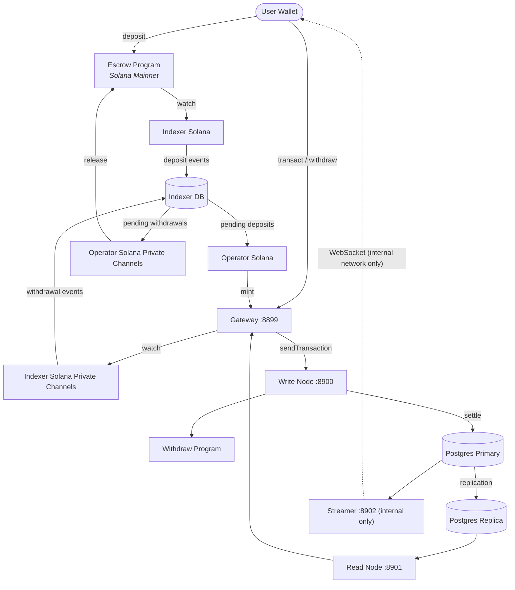

# Solana Private Channels Architecture

Solana Private Channels is a **payment channel** with direct access to Solana Mainnet liquidity. It enables instant finality, zero-fee transactions, and custom compliance rules with assets readily accessible to and from Solana Mainnet.

### Key Features

- **Instant Finality**: Transactions settle in ~100ms (configurable)
- **Zero Fees**: Gasless transactions via synthetic fee payer accounts
- **Privacy**: Private transaction batching with controlled access
- **Solana Compatible**: Runs standard Solana programs: SPL Token and Token Extensions
- **Mainnet Access**: Cryptographically secure token deposits and withdrawals

Solana Private Channels achieves these features through escrow/withdraw programs and an indexer/operator that syncs deposits/withdrawals with Solana Mainnet.

### Table of Contents

- [Solana Private Channels Core](#private-channel-core)
- [Escrow & Withdrawal Programs](#escrow--withdrawal-programs)
- [Indexer & Operator](#indexer--operator)
- [Database Layer](#database-layer)

## Core Components

### Solana Private Channels Core

The core payment channel processes transactions through a five-stage pipeline optimized for low latency and high throughput.

**Location**: [`core/`](../core/)

**Key Features**:
- Five-stage transaction pipeline: Dedup → SigVerify → Sequencer → Executor → Settler
- PostgreSQL-backed state with replication support
- Read/write node separation for horizontal scaling
- GaslessCallback for zero-fee transactions

### Escrow & Withdrawal Programs

#### Escrow Program (Devnet)

**Purpose**: Locks tokens in escrow for use within the payment channel.

**Program ID**: `GokvZqD2yP696rzNBNbQvcZ4VsLW7jNvFXU1kW9m7k83` (Solana Devnet)

**Location**: [`private-channel-escrow-program/`](../private-channel-escrow-program/)

**Key Instructions**:
- `CreateInstance`: Initialize a new escrow instance with admin
- `AllowMint`/`BlockMint`: Manage whitelisted SPL token mints for deposits
- `AddOperator`/`RemoveOperator`: Manage authorized operators
- `Deposit`: Lock user tokens in escrow (permissionless)
- `ReleaseFunds`: Withdraw funds with SMT proof verification

**Security**:
- Isolation for each Solana Private Channels instance (with unique admin, operators, mints, and Merkle tree roots)
- Sparse Merkle Tree (SMT) proof verification to prevent double spending of withdrawals
- Admin-only mint whitelisting
- Operator-based withdrawal processing

#### Withdrawal Program (Channel)

**Purpose**: Burns tokens from payment channel and unlocks them from the escrow program.

**Program ID**: `J231K9UEpS4y4KAPwGc4gsMNCjKFRMYcQBcjVW7vBhVi`

**Location**: `private-channel-withdraw-program/`

**Key Instructions**:
- `WithdrawFunds`: Burn tokens from payment channel and unlock them from the escrow program

### Indexer & Operator

The Indexer monitors blockchain activity and the Operator processes pending deposit and withdrawal transactions.

**Location**: [`indexer/`](../indexer/)

**Components**:
1. **Indexer**: Monitors blockchain activity and writes to database
2. **Operator**: Processes pending transactions and executes deposit/withdrawal operations

**Supported Modes**:
- **Mainnet Indexer**: Yellowstone gRPC or RPC polling
- **Channel Indexer**: RPC polling

**Architecture**: Three-stage pipeline per operator instance:
- **Fetcher**: Polls database for pending transactions
- **Processor**: Validates and prepares transactions
- **Sender**: Submits transactions to Solana

### Database Layer

PostgreSQL 16+ with streaming replication

**Databases**:

1. **Solana Private Channels DB** (`private_channel`): Payment channel account state and transaction history
   - Accounts table (pubkey, data, lamports, owner, slot)
   - Transactions table (signature, slot, status, block_time)
   - Blocks table (slot, blockhash, parent_slot, block_time)
   - Performance samples table (throughput metrics)

   Location: [`core/`](../core/src/accounts/postgres.rs)

2. **Indexer DB** (`indexer`): Deposit/withdrawal transaction tracking
   - Transactions table (deposits/withdrawals with status tracking)
   - Mints table (token metadata)
   - Indexer state table (checkpoint tracking)

   Location: [`indexer/`](../indexer/src/storage/)

## System Diagram

### Data Flow Summary

| Flow | Path |
|------|------|
| **Deposit** | User → Escrow Program (Mainnet) → Indexer Solana → Indexer DB → Operator Solana → Gateway → Write Node (mint on Solana Private Channels) |
| **Transfer** | User → Gateway → Write Node → Postgres Primary |
| **Withdrawal** | User → Gateway → Write Node → Withdraw Program (burn) → Indexer Solana Private Channels → Indexer DB → Operator Solana Private Channels → Escrow Program (release on Mainnet) |
| **Reads** | User → Gateway → Read Node → Postgres Replica |
| **Streaming** | Postgres Primary → Streamer → WebSocket (internal network only; not publicly exposed) → in-network consumer |